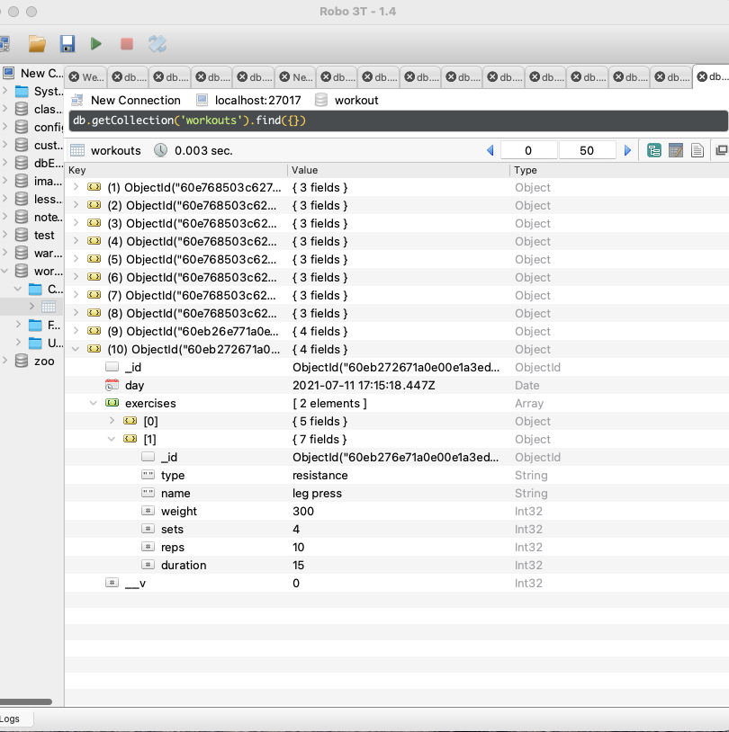
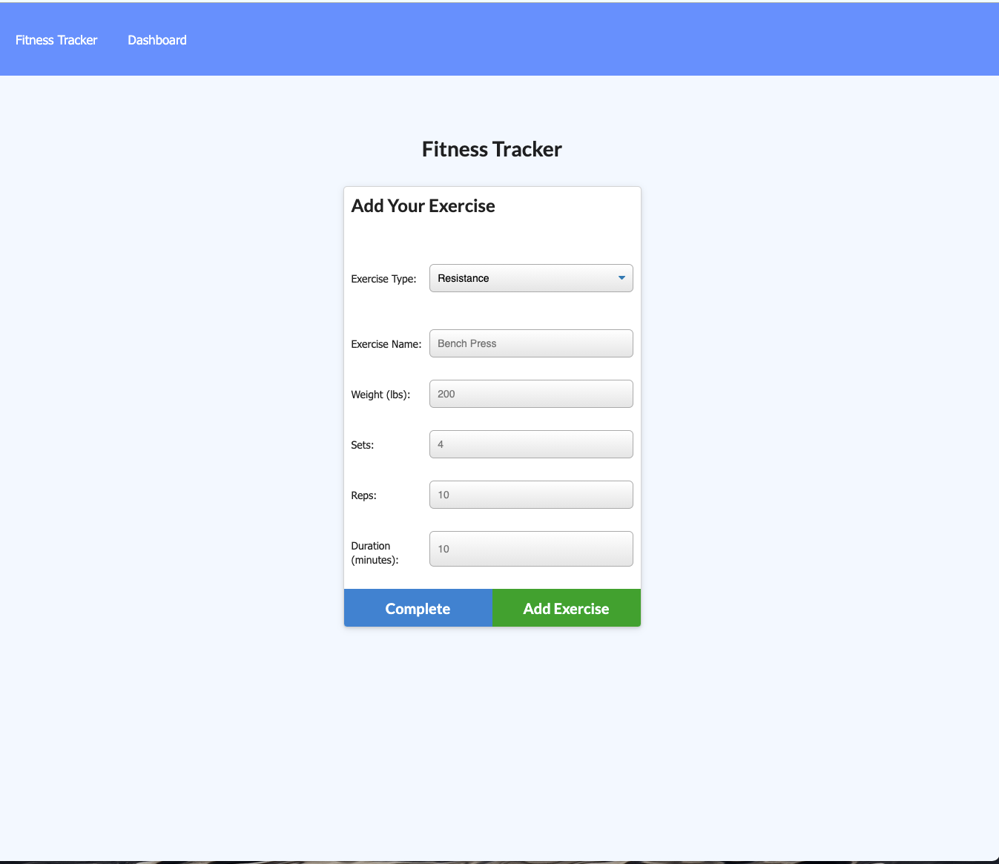

# workout-tracker
Create and track daily workouts, log multiple exercise in a workout on a given day.

## Description:

This application allows a user to track and log daily workouts on any given day. The application uses the Mongodb to keep data persistent, 
## Installation

This application runs on the heroku server. Click [here](https://stark-refuge-70218.herokuapp.com/?id=60eb3789f9f5320015f49b76) to visit the application.

## License

This application is license through MIT. You can find more out more about the license at : .

## Usage
For testing purposes, recommend using Robo 3T to connect to Mongodb to verify routes and CRUD operations of DB

## Questions:

For any questions about this application please contact me github: https://github.com/reggiemace
Additional questions can be sent to mailto:reginaldmace36@gmail.com.
